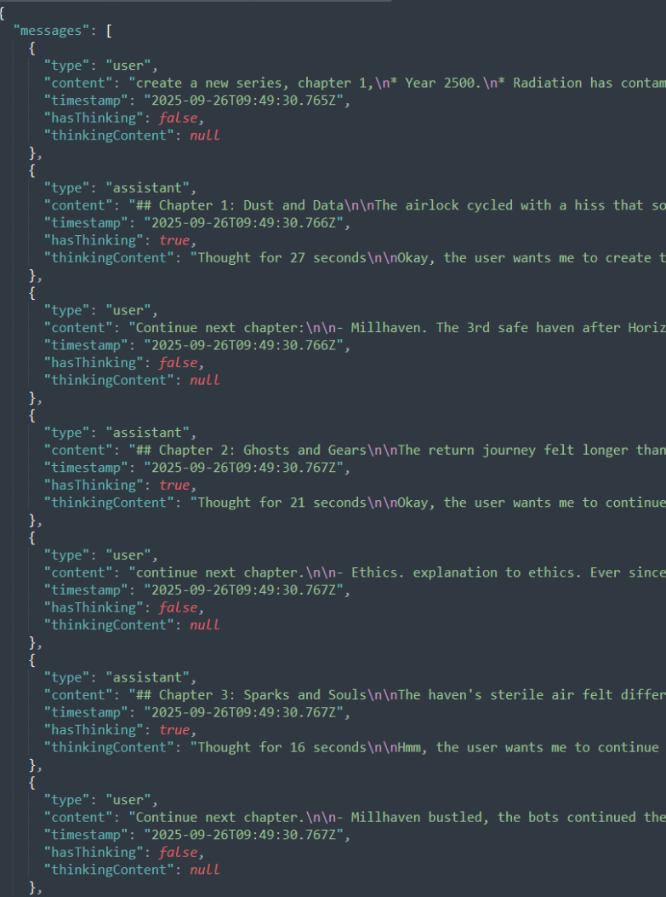
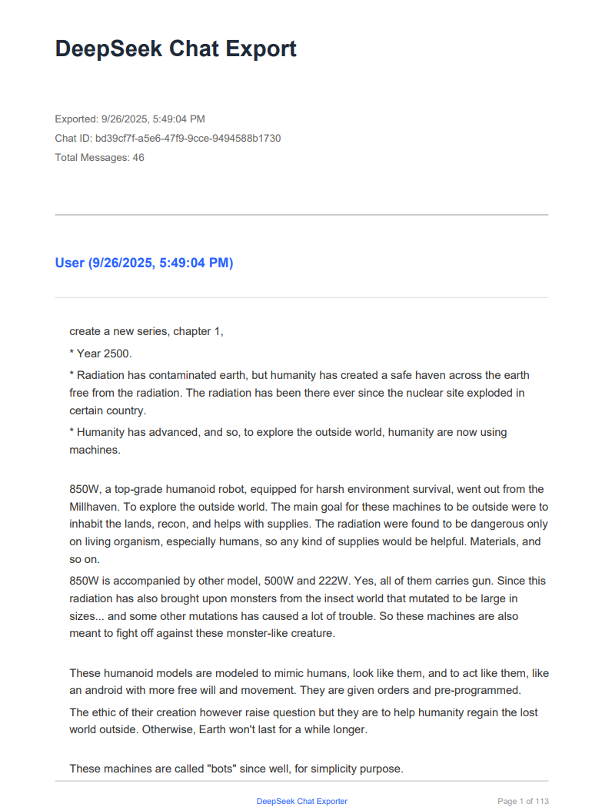
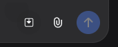
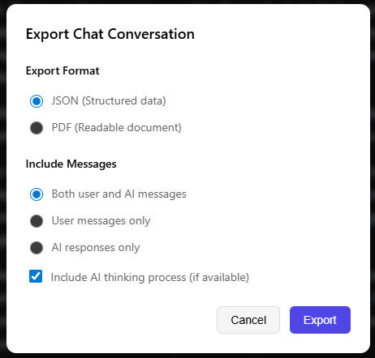

  

<h1 align="center">DeepSeek Chat Exporter</h1>

  A Chrome extension to export DeepSeek chat conversations to JSON or PDF

---

| JSON | PDF |
|:------:|:-----:|
|  |  |

---

### Features

- **Export Formats**: JSON and PDF
- **Message Filtering**: Export user messages only, AI responses only, or both
- **Thinking Process**: Option to include or exclude AI thinking blocks

## Installation
### 1. Source
1. Clone or download this repository
2. Open Chrome and navigate to `chrome://extensions/`
3. Enable "Developer mode" in the top right
4. Click "Load unpacked" and select the `extension` folder
5. Visit https://chat.deepseek.com and start chatting
6. The export button will appear next to the paperclip icon in the chat interface

## Usage

1. Navigate to any DeepSeek chat conversation
2. Look for the export button (download icon) next to the file attachment button

   

3. Click the export button to open the export modal
4. Choose your preferences:

   - **Format**: JSON or PDF
   - **Messages**: Both, user only, or AI only
   - **Thinking**: Include AI thinking process or not

   

5. Click "Export" and the file will be downloaded automatically

## Acknowledgement

- [**jsPDF**](https://www.npmjs.com/package/jspdf/v/2.5.1?activeTab=readme) (v3.0.3)

## License

Licensed under the [MIT License](LICENSE).
